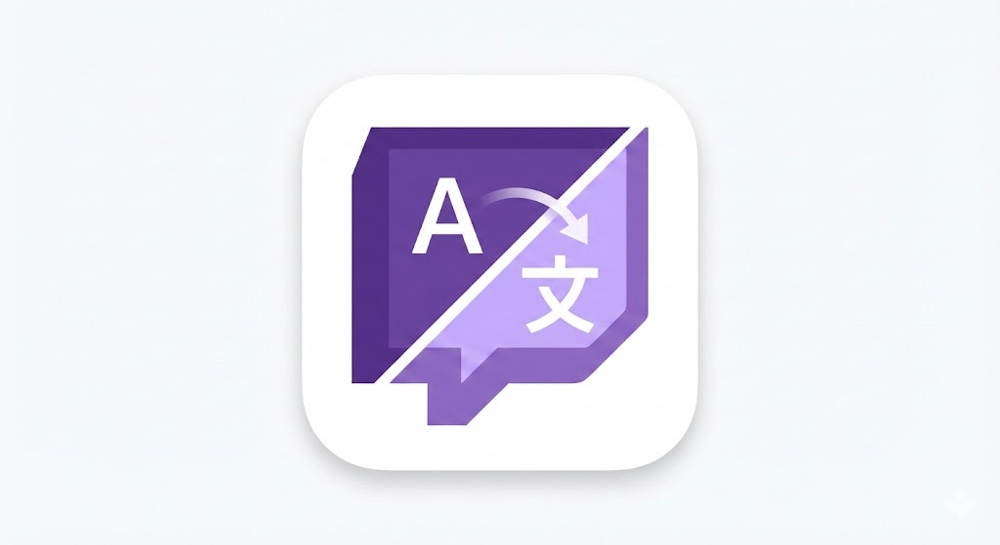

# TwitchChatTranslator (DeepL Translator)

Chrome Extension (Manifest V3) that **translates live Twitch chat messages** on `twitch.tv` using **DeepL** and injects the translation under each message.

## Getting a free DeepL API key
1. Go to DeepL signup: `https://www.deepl.com/signup`
2. Create an account and choose **DeepL API Free**.
3. After signup/login, open your DeepL account page and find **API keys & limits**.
4. Create/copy your **Auth Key** (DeepL may only show it once / via a copy button).
5. In this extension’s **Options** page:
   - Paste it into **DeepL API key**
   - Set **DeepL endpoint** to **Free API (api-free.deepl.com)** (unless you have Pro)

Notes:
- DeepL API Free has a monthly character limit (check **API keys & limits** in your DeepL account).
- Treat your Auth Key like a password. If it leaks, revoke it in DeepL and create a new one.

## What it does
- Watches Twitch chat for new messages (handles Twitch DOM re-use / re-mounts).
- Translates each message via **DeepL** and injects a translated line under it.
- Still logs extracted message text as `[TCT] ...` in the console.
- Has a popup toggle to enable/disable the translator.

## Install (Load unpacked)
1. Open Chrome and go to `chrome://extensions`
2. Enable **Developer mode**
3. Click **Load unpacked**
4. Select this folder (the one containing `manifest.json`)

## Use
1. Open a Twitch channel page (`https://www.twitch.tv/<channel>`) or popout chat.
2. Click the extension icon.
3. Toggle **Enable extractor** ON.
4. Open the Twitch tab DevTools Console (F12) and look for:
   - `[TCT] enabled`
   - `[TCT] attached`
   - `[TCT] ...` (message logs)

To stop it, toggle OFF (you should see `[TCT] disabled`).

Tip: In the Console, filter for `[TCT]` to only see extractor logs.

## Files
- `manifest.json`: Extension manifest (MV3)
- `content.js`: Twitch chat observer + text extraction + translation injection
- `popup.html` / `popup.js`: Enable/disable toggle stored in `chrome.storage.sync`
- `options.html` / `options.js`: Configure DeepL (endpoint + API key) and target language
- `background.js`: DeepL translation + caching (service worker)

## Next steps
Add quality improvements (language autodetect tuning, better UI styling, rate limiting, and per-channel settings).

