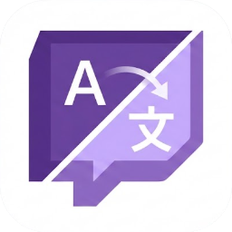
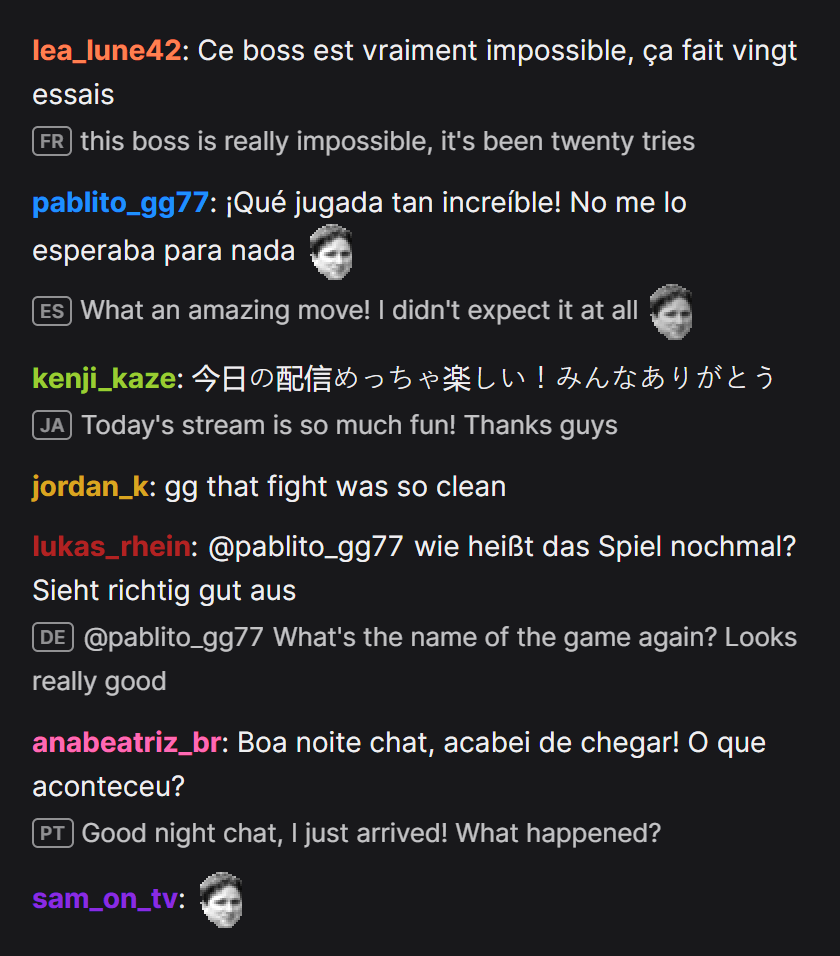

  

<h1 align="center">Twitch Chat Translator</h1>

  <strong>Read any Twitch chat in your own language.</strong> 
  A lightweight Chrome extension that translates chat messages as they arrive — on your own computer with Chrome's built-in translator, free and private, or with DeepL.

  

## Features

- **Live, popout and VOD chat** — each translation appears right under its message, or in place of it
- **Free and private by default** — uses the translator built into Chrome: no account, no API key, and messages never leave your computer
- **DeepL when you want it** — better with slang and rare languages; bring your own API key, or use DeepL only for the languages Chrome can't translate
- **Keeps the chat readable** — emotes, @mentions and links stay where they were; messages already in your language, emote spam and one-word reactions are left alone
- **Works with 7TV, BetterTTV and FrankerFaceZ**

## Installation

> Not on any store yet — install it manually:

Download the repository: **Code → Download ZIP** on [GitHub](https://github.com/Alban1911/TwitchChatTranslator) (or `git clone`), then unzip it.

### Chrome / Chromium

1. Open `chrome://extensions`
2. Enable **Developer mode** (top-right toggle)
3. Click **Load unpacked** and select the `TwitchChatTranslator` folder

On-device translation uses the translator built into desktop Chrome 138 and later. Browsers without it can use the DeepL engine.

## Usage

1. Open any Twitch channel, popout chat or VOD
2. Click the extension icon, turn on **Translator** and pick the language to translate into
3. **The first time a language shows up**, Chrome downloads its translation model. If a notice in the bottom-right corner asks for it, **click anywhere on the page** to let the download start — it's needed once per language, and translations are instant after that, even after restarting Chrome
4. Translations appear under each message, tagged with the original language (**FR**, **ES**, **JA**…)

In the popup:

| Setting | What it does |
|---|---|
| **Translator** | Turn translation on or off |
| **Engine** | **On-device** (free and private, the default) or **DeepL** (needs an API key) |
| **Translate into** | The language you want to read |
| **Show translations** | **Under the original**, or **Instead of the original** (hover a translation to see the original) |

**Options…** in the popup has the rest: your DeepL key, the language tags, and a **Try it** box to check that translation works.

### Using DeepL

1. Create an account on the [DeepL API page](https://www.deepl.com/pro-api) and pick **DeepL API Free** (500,000 characters a month)
2. In your DeepL account, open **API keys & limits** and copy your key
3. In the extension's **Options…**, choose **DeepL** and paste the key — Free and Pro keys are both recognized
4. Press **Translate** under **Try it** to check that it works

To keep translating on-device and only send DeepL the languages Chrome can't handle, leave the engine on **On-device** and tick **send messages in languages it doesn't support to DeepL** instead.

## Good to know

- Very short messages ("lol", "gg", emote names) and one-word reactions aren't translated — there isn't enough text to tell their language reliably
- Translation pauses while the Twitch tab is in the background and catches up when you come back
- The toolbar icon shows **✓** when the translator is on, **×** when it's off, and **!** when DeepL has a problem (hover it for details); the popup tells you what's happening in the current tab
- With DeepL, messages the extension is sure are already in your language are never sent, which saves your quota; your API key is stored only on this computer, never synced
- No tracking, no analytics

## License

[MIT](LICENSE)
